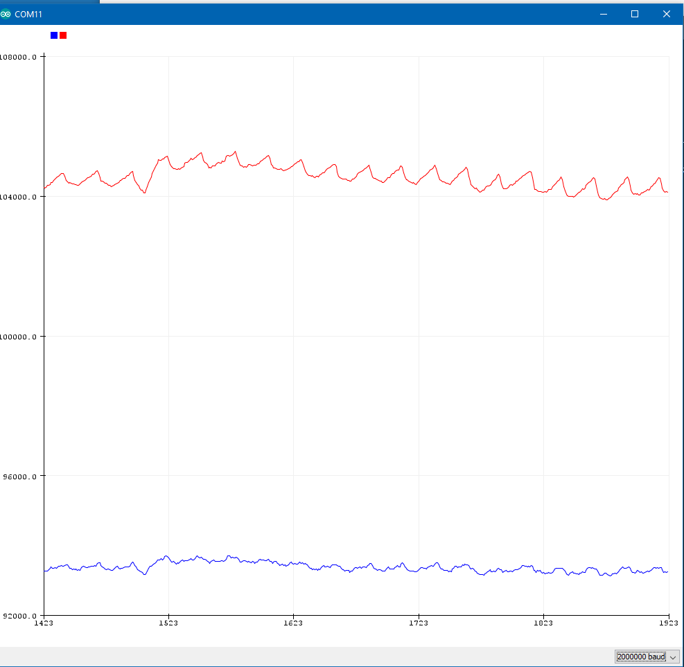

# EmotiBit MAX30101 Basic Example

## Setup
- Connect the emotibit to the Feather.
- Plug in the feather to the computer and upload this example.

## Run the Example
- After the code has been uploaded, reset the feather and open the Serial Plotter in Arduino.
- If the sensor is connected, you sould see the Serial Plotter plot values of the IR and RED leds.
- Place your finger on the sensor. Let the plot settle and you should see the plot display your heartbeat.
- 
